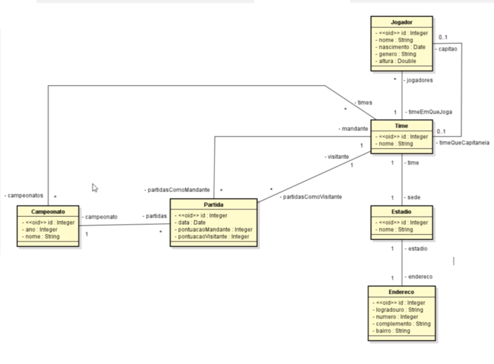

# Campeonato 
 

# Sobre o projeto

Campeonato é uma API REST desenvolvida com SpringFramework. Essa aplicação esta baseada nos requisitos e diagrama UML abaixo, um exercicio do curso de Modelagem de Dados com UML (DevSuperior).

## Requisitos
Deseja-se construir um sistema para gerenciar as informações de
campeonatos de handebol, que ocorrem todo ano. Deseja-se saber nome, data de nascimento, gênero e
altura dos jogadores de cada time, bem como qual deles é o capitão de cada time. Cada partida do
campeonato ocorre em um estádio, que possui nome e endereço. Cada time possui seu estádio-sede e,
assim, cada partida possui um time mandante (anfitrião) e o time visitante. O sistema deve ser capaz
de listar as partidas já ocorridas e não ocorridas de um campeonato. O sistema deve também ser capaz
de listar a tabela do campeonato, ordenando os times por classificação, que é calculada em primeiro
lugar por saldo de vitórias e em segundo lugar por saldo de gols.

## UML - Modelo conceitual

# Tecnologias utilizadas
## Back end
- Java 17
- Spring Boot 2.7.1
- JPA / Hibernate
- Maven
- Banco de dados H2.
- Spring Tool Suite 4

# Autor

William Henrique Campos

https://www.linkedin.com/in/william-henrique-campos-98568813a/
